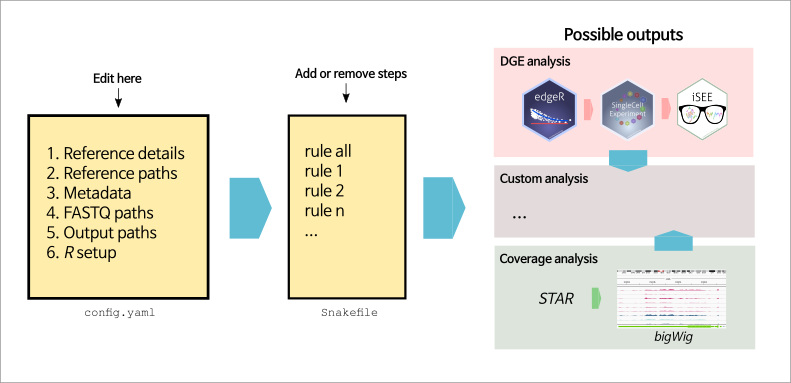

# RNA-seq workflow

 <span style="color:blue">**Note: This is work in development, mainly as a template for personal use, and it is provided "as-is", without guarantees of robustness, correctness or optimality. Please use responsibly.**</span>

This RNA-seq workflow consists of a `Snakefile`, a [`conda`](https://conda.io/docs/) environment file (`envs/environment.yaml`) a configuration file (`config.yaml`) and a set of R scripts to perform quality control, preprocessing and differential expression analysis of RNA-seq data. The output can be combined with the [`iResViewer`](https://github.com/csoneson/iResViewer) R package to generate a shiny application for browsing and sharing the results.



## Using the RNA-seq workflow
To use the RNA-seq workflow on your own data, follow the steps outlined below carefully

1. Clone this repository to your local machine and set the working directory to the cloned repository: 

	```
	git clone https://github.com/csoneson/rnaseqworkflow.git
	cd rnaseqworkflow
	```

1. [Prepare the input files (FASTQ files and a metadata file)](https://github.com/csoneson/rnaseqworkflow/wiki/Preparing-the-input-files)

1. [Prepare the configuration file (`config.yaml`)](https://github.com/csoneson/rnaseqworkflow/wiki/The-config.yaml-configuration-file)

1.	Make sure that all the necessary software is available. This can be done in two ways:

	a. [Set up and activate a `conda` environment](https://github.com/csoneson/rnaseqworkflow/wiki/conda-environment)
	
	b. [Install software manually](https://github.com/csoneson/rnaseqworkflow/wiki/Installing-software-manually)

1. [Set up the proper experimental design and contrast(s) for differential expression analysis](https://github.com/csoneson/rnaseqworkflow/wiki/Setting-up-the-DGE-analysis)

1. [Run the analysis](https://github.com/csoneson/rnaseqworkflow/wiki/Running-the-analysis)

## Testing the setup
If you would like to test the installation of the RNA-seq workflow, we provide a small [example data set](https://github.com/csoneson/rnaseqworkflow_exampledata). This repository contains paired compressed FASTQ files for four samples from the [GSE52778](https://www.ncbi.nlm.nih.gov/geo/query/acc.cgi?acc=GSE52778) data set, containing only reads aligning to the first 10M bases of chromosome 1 (in the `FASTQ` directory). In addition, the directory contains a metadata table with information about the four samples, and a `reference` directory with two collections of reference files (Gencode v28 and Ensembl v93). To use this data set to test your installation, clone the repository and set the paths to the input files, the metadata file and the reference files properly in the `config.yaml` file. 

## Checking software versions

The workflow contains two rules to check the versions of the software that has been used. To check the versions of R packages, running `snakemake listpackages` will parse the output files generated by `R CMD BATCH` and extract all used R packages. The results will be written to a text file. To check the versions of other software, running `snakemake softwareversions` will check the versions of the software. Finally, the `log` directory contains log files, which should state the version of all software that was used. 

## Visualizing results with `iSEE`

The output file of the workflow (`output/outputR/shiny_sce.rds`) can be directly used as input to the [`iSEE`](https://bioconductor.org/packages/release/bioc/html/iSEE.html) package in order to generate a shiny application where the results can be viewed. After installing `iSEE`, the following code will start a shiny application where you can browse the results:

```
library(iSEE)

sce <- readRDS("example_data/output/outputR/shiny_sce.rds")

# sce on gene level
sce_g <- sce$sce_gene

# sce on transcript level
sce_t <- sce$sce_tx

# for example to see results on gene level
app <- iSEE(sce_g)
shiny::runApp(app)
```

## Interactive R sessions

Note that this repository includes an `.Renviron` file witch is used to automatically configure R on startup. This is useful when you have an active conda environment and you want to explore your data in an interactive R session (started in the rnaseqworkflow directory). The `.Renviron` file removes any user specific library paths on startup, ensuring that you will only have access to R packages that are installed in the active conda environment.

